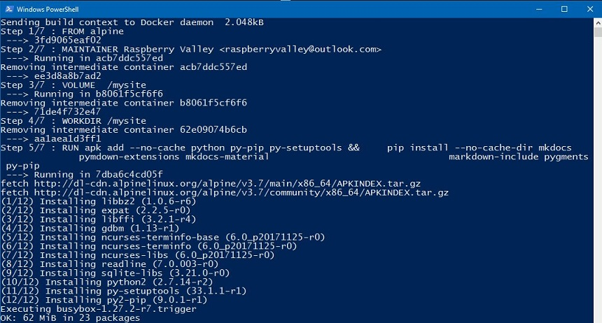
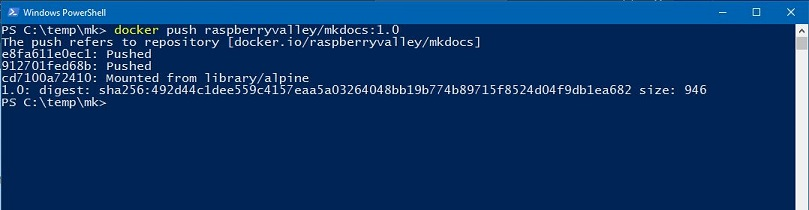
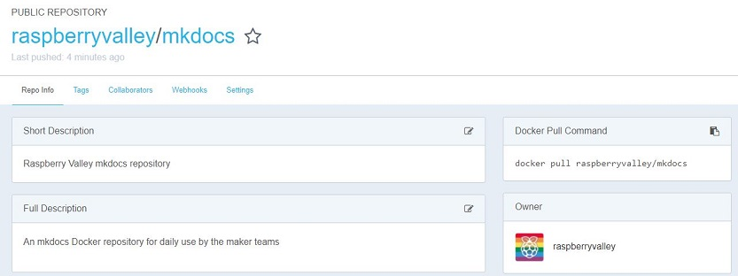
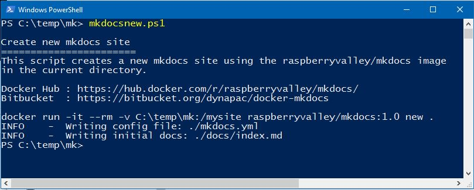
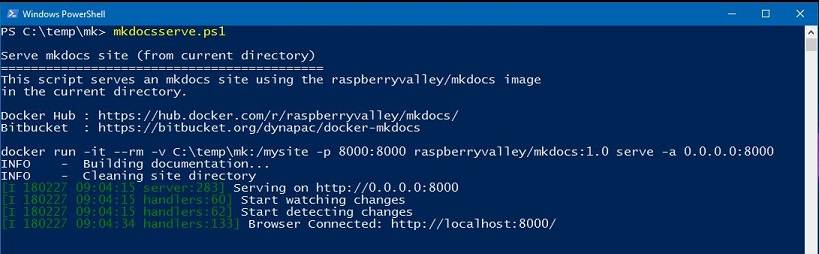
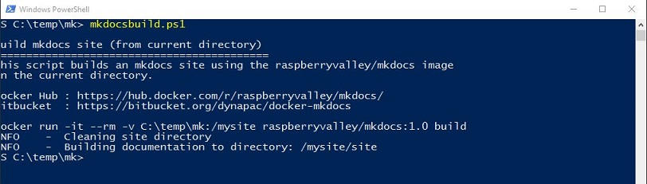

# RaspberryValley MkDocks Docker Image

We write a lot at the [Raspberry Valley](https://raspberry-valley.azurewebsites.net) makerspace. To share our tools without the hassle of installation, we reverted recently to Docker deployments, both for techies and authors.

This is our Docker Image for running [MkDocs](http://www.mkdocs.org/). It is based on [Alpine](https://hub.docker.com/_/alpine/), a minimal Docker image based on Alpine Linux with a complete package index and only 5 MB in size. We were inspired by [elamperti](https://hub.docker.com/r/elamperti/docker-mkdocs/) and his MKDocks image.

Our Dockerfile and instructions are is available at GitHub

## Introduction

This documentation describes the creation and usage of the *MkDocs* image. On top we provide a few *PowerShell* scripts to simplify day-to-day authoring of content.

To learn more about setting up your project in *MkDocs* and working with the tool, see the [MkDocs Getting Started](http://www.mkdocs.org/#getting-started) manual.

> Please note: We always assume that you run all commands from the directory where your *MkDocs* site is, or will be. You can easily confirm you are in the right directory if you see the Yaml file.

## Building the image

First, let us prepare our image.

* Navigate to an empty folder and pull this *Git* repository
* Open your shell (both the Dos prompt and PowerShell will work) and run the following

```bash
docker build -t raspberryvalley/mkdocs .
```

You should end up with output similar to this:



**NOTE**: please don't forget the dot at the end of the command

## Push image

We can push our image to [Docker Hub](https://hub.docker.com). We assume here you have an account and can log in.

First, let's 'tag' the image. Basically give it a 'label' which identifies a version of the system, target platform etc.

```bash
docker tag raspberryvalley/mkdocs raspberryvalley/mkdocs:1.0
```

Let us now push the docker image to Docker Hub (you need to login first)

```bash
docker login
docker push raspberryvalley/mkdocs:1.0
```

You should see something similar to this:



And, on your Docker repository, you can see the image for re-use. Don't forget to edit the title and the description 



## Building a project

To generate a static site using the docker image, run

```bash
docker run -it -v $(pwd):/mysite mkdocs build
```

**Notes**:

* We assume you are in a directory where a valid MkDocs site is
* **$(pwd)** expands the current directory. There are issues in Windows doing this. In such a case, expand to the full path in the command-line

```bash
docker run -it -v c:\somedirectory\somesite:/mysite mkdocs build
```

or

```bash
docker run -it -v /c/somedirectory/somesite:/mysite mkdocs build
```

* It's a good idea to remove the container immediately after it was used. Use the switch **--rm** to achieve this

## Serving a project

The current project directory will be served and can be tested in your browser

```bash
docker run -it -v $(pwd):/mysite -p 8000:8000 mkdocs serve -a 0.0.0.0:8000
```

## Starting a new project

You might need to start a new project using the MkDocs inbuilt features. It really is trivial and not always needed. But just in case, this is how you start one in the current directory.

```bash
docker run -it -v $(pwd):/mysite mkdocs new .
```

## Powershell Scripts

It is tedious to always write the full docker command on the command line. Now I do not recommend to use the below scripts immediately (there's no better learning than getting the manual effort into your bloodstream), but once you are convinced you know how things work, it's time to start working with PowerShell Scripts.

Just copy them from our **ps-scripts** directory somewhere onto your path, or simply copy-paste the scripts from below.

## Creating a new website

To create a new website in mkdocs, simply use the script below. The name in the scripts directory is **mkdocsnew.ps1**. Note this scripts creates a new site in the current directory of your powershell console by utilizing our mkdocs image. The mkdocs parameter 'sitename' is ignored.

```powershell
# Script to create a new mkdocs repository using our Docker image
# Petr Hutar (petr.hutar@dynapac.com)

Write-Host 
"Create new mkdocs site
=======================
This script creates a new mkdocs site using the raspberryvalley/mkdocs image
in the current directory.

Docker Hub : https://hub.docker.com/r/raspberryvalley/mkdocs/
Bitbucket  : https://bitbucket.org/dynapac/docker-mkdocs
"

# docker run -it -v $(pwd):/mysite mkdocs new .
$command = "docker run -it --rm -v $(pwd):/mysite raspberryvalley/mkdocs:1.0 new ."
Write-Output $command
iex $command
```

Once you run the script on a directory, you can see something similar to the below:



## Serve existing mkdocs site

To serve an existing site you your local machine, yuu can use the powershell script **mkdocsserve.ps1**. Navigate to the directory where your site is (in powershell), then simply run the script (grab it from our repository or use the code below). If the script is on your path, you're in business.

```powershell
# Script to serve an existing mkdocs site using our Docker image

Write-Host
"Serve mkdocs site (from current directory)
===========================================
This script serves an mkdocs site using the raspberryvalley/mkdocs image
in the current directory.

Docker Hub : https://hub.docker.com/r/raspberryvalley/mkdocs/
Bitbucket  : https://bitbucket.org/dynapac/docker-mkdocs
"

# docker run -it --rm -v $(pwd):/mysite -p 8000:8000 mkdocs serve -a 0.0.0.0:8000

$command = "docker run -it --rm -v $(pwd):/mysite -p 8000:8000 raspberryvalley/mkdocs:1.0 serve -a 0.0.0.0:8000"
Write-Output $command
iex $command
```

Your output in the console can be similar to the below



## Build existing mkdocs site

Time to build an existing mkdocs site. You can use our script **mkdocsbuild.ps1** or simply copy the script below. Navigate to the directory with your mkdocs source and invoke the script.

```powershell
# Script to build an existing mkdocs site using our Docker image

Write-Host
"Build mkdocs site (from current directory)
===========================================
This script builds an mkdocs site using the raspberryvalley/mkdocs image
in the current directory.

Docker Hub : https://hub.docker.com/r/raspberryvalley/mkdocs/
Bitbucket  : https://bitbucket.org/dynapac/docker-mkdocs
"

$command = "docker run -it --rm -v $(pwd):/mysite raspberryvalley/mkdocs:1.0 build"
Write-Output $command
iex $command
```

The output is as follows.



## Links

* [Raspberry Valley MkDocs image on Docker Hub](https://hub.docker.com/r/raspberryvalley/mkdocs/)
* [Raspberry Valley makerspace pages](https://raspberry-valley.azurewebsites.net)
* [Visit us on Twitter](https://twitter.com/RaspberryValley)

And related to this article:

* [Alpine](https://hub.docker.com/_/alpine/)
* [3 biggest wins when using Alpine as a base image](https://diveintodocker.com/blog/the-3-biggest-wins-when-using-alpine-as-a-base-docker-image)
* [MkDocs](http://www.mkdocs.org/)

